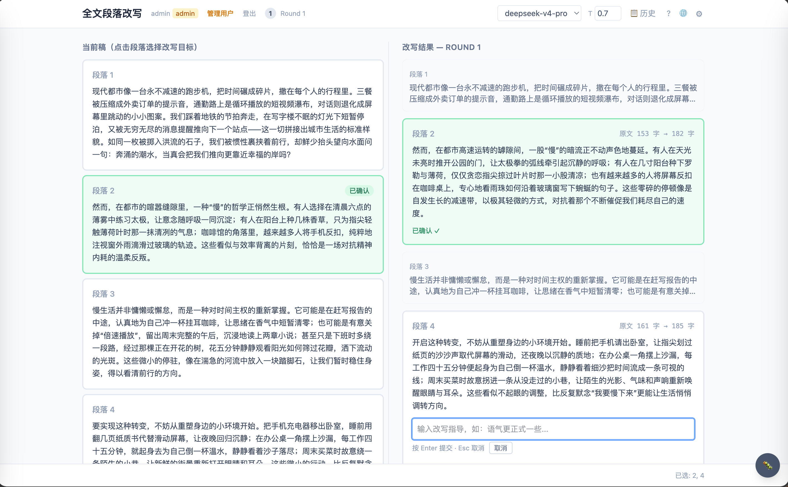

# 全文段落改写 / Paragraph Rewriter

一个交互式多轮段落改写应用。用户提交文章后指定需要改写的段落，系统在保持全文逻辑连贯性的前提下仅改写目标段落。每轮可选择不同段落，改写结果累积增量更新。

采用双栏并排 Diff 视图（类似 VS Code Git Diff），支持批量段落选择、并行流式生成、逐段审查（接受/指导重写/手动编辑）和多轮增量改写。

<p align="center">
  
</p>

## 功能特性

- **多 Agent 协作架构**：调度Agent（有状态）、生成Agent、校验Agent、语义分析Agent 协同工作
- **双栏 Diff 视图**：左侧当前稿，右侧流式改写结果实时展现
- **并行 SSE 流式输出**：所有目标段落同时生成，逐 token 实时渲染
- **多轮增量改写**：提交本轮后继续选择段落开始新一轮，完整历史记录
- **指导式重写**：逐段内联输入自然语言指令，引导 LLM 重写方向
- **版本回溯**：每个段落可查看历史版本、预览、恢复
- **用户认证**：Access Key 认证，管理员面板管理用户
- **中英文切换**：界面支持中文/英文
- **DEBUG 模式**：`?debug=true` 开启进度条、SSE 事件日志、服务器日志面板
- **模型配置**：运行时热切换模型、调节 temperature、增删模型

## 快速开始

### 方式一：Docker Compose（推荐）

```bash
# 1. 克隆仓库
git clone https://github.com/PeterYRZ/Rewrite.git
cd Rewrite

# 2. 准备配置文件
cp config.yaml.example config.yaml
# 编辑 config.yaml，设置你的 API Key
cp users.json.example users.json

# 3. 启动
docker compose up
```

访问 **http://localhost:5173** 即可使用。

如需更改端口，启动时设置环境变量：
```bash
SERVER_PORT=9000 FRONTEND_PORT=3000 docker compose up
```

### 方式二：单容器部署（生产环境）

```bash
# 构建镜像
docker build -t paragraph-rewriter .

# 运行（默认端口 8000；修改 -p 映射即可使用其他端口）
docker run -p 8000:8000 \
  -v $(pwd)/config.yaml:/app/config.yaml \
  -v $(pwd)/users.json:/app/users.json \
  paragraph-rewriter
```

访问 **http://localhost:8000**（或你的自定义端口）即可使用。

### 方式三：手动部署

**环境要求**：Python 3.14+、Node.js 22+

```bash
# 1. 克隆并配置
git clone https://github.com/PeterYRZ/Rewrite.git
cd Rewrite
cp config.yaml.example config.yaml   # 设置 API Key
cp users.json.example users.json

# 2. 启动后端
uv sync
export $(grep -v '^#' .env 2>/dev/null | xargs)  # 如使用 .env 加载环境变量
uv run rewrite-server

# 3. 启动前端（新终端窗口）
cd web
npm install
npm run dev
```

后端运行在 **http://localhost:8000**（可通过 `config.yaml` → `server.port` 修改），前端运行在 **http://localhost:5173**。若修改了后端端口，启动前端时需设置：
```bash
VITE_API_PORT=9000 npm run dev
```

## 配置说明

### config.yaml

复制 `config.yaml.example` 为 `config.yaml` 并配置：

```yaml
server:
  port: 8000           # 后端 API 端口
  frontend_port: 5173  # 前端开发服务器端口

models:
  - name: gpt-4o
    provider: openai
    model: gpt-4o
    api_key: "$OPENAI_API_KEY"    # 或直接填写

rewrite:
  temperature: 0.7
  max_tokens: 2000
  candidates_count: 3

validation:
  enabled: true
  strictness: "medium"
```

后端端口在启动时从 `config.yaml` 读取。手动启动前端时，通过 `VITE_API_PORT` 环境变量指定后端端口（默认 8000）。

API Key 可直接写在 `config.yaml` 中（此文件已在 .gitignore 中排除），也可通过 `$变量名` 引用环境变量。

### users.json

复制 `users.json.example` 为 `users.json`：

```json
{
  "users": [
    { "username": "admin", "access_key": "rw-admin-xxxx", "role": "admin" },
    { "username": "demo", "access_key": "rw-demo-xxxx", "role": "user" }
  ]
}
```

在登录页输入 Access Key 即可使用。admin 用户可通过管理面板管理其他用户。

## 架构概览

```
┌──────────────┐
│   调度Agent   │ ← 唯一有状态组件，状态机、上下文组装、多轮会话管理
└──────┬───────┘
       │ 直接函数调用
  ┌────┼────┬────────┐
  ▼    ▼    ▼        ▼
生成    校验    语义分析  （无状态）
```

- **双文档上下文策略**：原始文档（不可变） + 当前文档（带状态标记）
- **SSE 流式输出**：FastAPI `StreamingResponse` + `asyncio.Queue` 实现并行推送
- **会话模型**：多轮改写会话，记录每轮历史

详细架构请参阅 [docs/tech-spec.md](docs/tech-spec.md)。

## 技术栈

| 层次 | 技术 |
|------|------|
| 后端 | Python 3.14、FastAPI、Pydantic、uvicorn |
| LLM | OpenAI SDK、Ollama（Provider 抽象层） |
| 前端 | React 19、Vite、Tailwind CSS 4、TypeScript |
| 流式传输 | SSE（Server-Sent Events） |
| 认证 | Access Key + 内存 Token 管理 |

## 开发指南

```bash
# 后端
uv sync
uv run rewrite-server

# 前端
cd web
npm install
npm run dev

# 运行测试
uv run pytest

# 构建前端生产包
cd web && npm run build
```

## 项目结构

```
Rewrite/
├── src/rewrite_engine/
│   ├── agents/          # 4 个 Agent（调度、生成、校验、语义分析）
│   ├── api/             # FastAPI 服务 + 认证
│   ├── llm/             # LLM Provider 抽象层
│   ├── models/          # 数据模型（Article、Session、Config）
│   └── pipelines/       # 改写流水线（全自动 + 交互式）
├── web/                 # React 前端
│   └── src/
│       ├── components/  # UI 组件
│       ├── hooks/       # 自定义 React Hooks
│       ├── i18n/        # 国际化
│       └── locales/     # zh-CN.json、en.json
├── docs/                # 技术规范 + 开发日志
├── data/                # 示例文章 + 测试用例
└── config.yaml.example  # 配置文件模板
```

## 许可证

MIT
